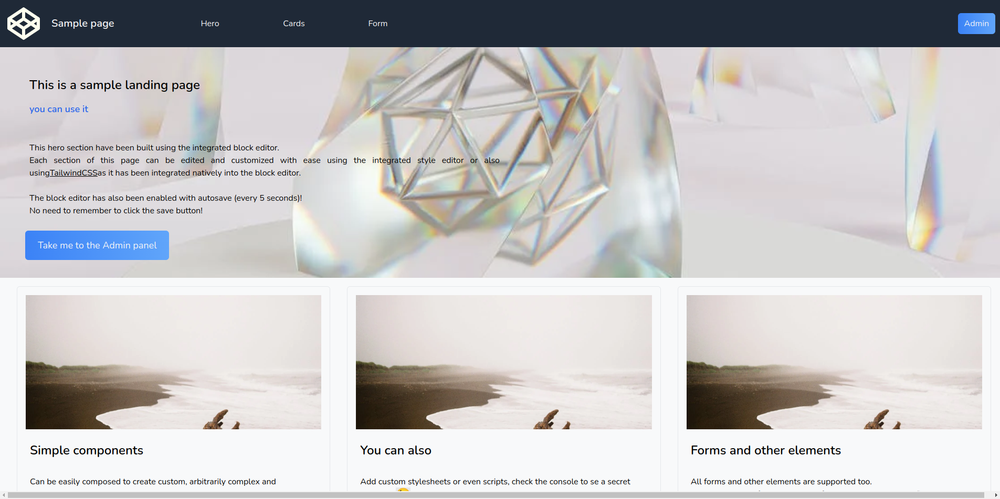
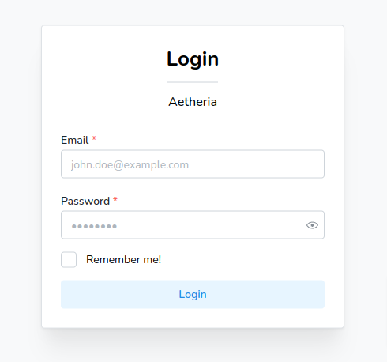
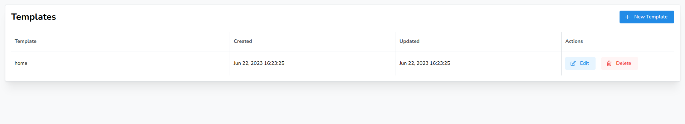
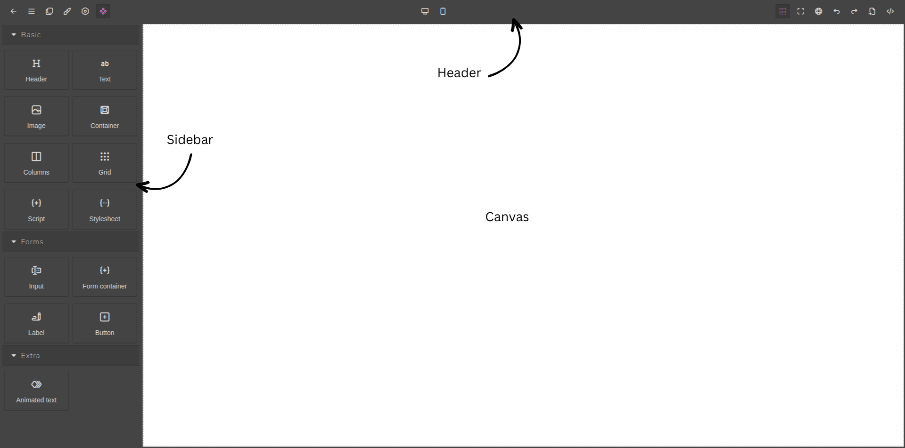

import Tabs from '@theme/Tabs';
import TabItem from '@theme/TabItem';

# Basic Usage

In this section, we will explore the fundamental functionalities and workflows of Aetheria, enabling you to effectively
utilize the CMS and create exceptional websites.

## Logging into the Aetheria dashboard

:::info
In order to log in to the Aetheria dashboard, you must have the CMS (frontend and backend) installed and running on your
system.

If you have not yet installed Aetheria, please refer to the [installation guide](/getting-started/installation).
:::

Upon the initial installation, Aetheria automatically sets up a default user with the email `john.doe@example.com` and
password `password`.

You can use these credentials to log in to the CMS and begin your journey with Aetheria.
We highly recommend changing the default user's credentials for security purposes once you have access to the CMS.

If you're using the official frontend, you can access the login page by navigating to `http://<your-domain>/admin` or
clicking on one of the two blue buttons.

The following form will be displayed letting you enter your credentials and log into the CMS.

## Overview of the user interface and navigation

The base installation of Aetheria includes two essential modules: the `User` module and the `Templates` module.
The `User` module provides functionalities related to authentication, and basic profile settings while the `Templates`
module allows you to manage and customize the website's templates for your content.

Upon logging in, users are directed to the template listing page, where they can begin creating and managing their
website's content using the available templates.

A default template named `home` is automatically created upon installation, and it is used to render the website's
homepage.
You can create additional templates to render other pages of your website, such as the `about` page, the `contact` page,
etc.

:::caution
The `home` template is automatically assigned to the homepage of your website, it can be deleted, but it should not as
otherwise the Next.js index page will be errored.

> This behavior will be subject to change as of [v1.1.x](/roadmap).
:::

## Creating and managing content

New templates can be created by clicking on the `New Template` button in the top right corner of the template listing,
this will open a new empty template in the editor.

It's important to note that the template's name must be unique, and that (at least in the base installation) the name
acts as the slug of the page, so it must be URL-friendly.

:::info Additional specification about the template name
If you're using the default frontend (**suggested**) the template name will be used to match the page's route, so if you
create a template named `about` the page will be accessible at `http://<your-domain>/about`.

Check out the following examples:

- `home` will be accessible at `http://<your-domain>/`
- `about` will be accessible at `http://<your-domain>/about`
- `contact` will be accessible at `http://<your-domain>/contact`
- `blog/post-slug` will be accessible at `http://<your-domain>/blog/post-slug`
- `blog/2023-06-22/post-slug` will be accessible at `http://<your-domain>/blog/2023-06-22/post-slug`
  :::

:::caution

A known bug exists in the method used to match the page's route

Creating 3 templates named `example`, `example/` and `example/index.html` with 3 different pages, respectively
rendered at `http://<your-domain>/example`, `http://<your-domain>/example/`
and `http://<your-domain>/example/index.html`.

The problem arises due to the fact that path ending with a slash are treated as directories, and the `index.html` file
is treated as the index file of the directory, so you would expect `http://<your-domain>/example/`
and `http://<your-domain>/example/index.html` to render the same page, but they don't.

Due to modern browser optimization and the fact that the `index.html` file doesn't really exists, the browser will
automatically redirect the user from `http://<your-domain>/example/` to `http://<your-domain>/example` finally resulting
in the render of the template named `example` instead of `example/`.

This means that the template named `example/` will never be rendered, and the template named `example/index.html` will
be rendered only if the user manually types the URL in the browser including the ending `index.html`.

> This behavior will be subject to change as of [v1.1.x](/roadmap).

:::

### The template editor

The template editor is the core of the CMS, it allows you to create and manage the content of your website.

The template editor is composed of three main sections:

- **Header**: the header contains the main navigation buttons.
- **Sidebar**: the sidebar contains all the utilities that can be used to create the content of the page.
- **Canvas**: the canvas is the area where the content of the page is rendered, it's also where you can interact with
  the content and edit it.

#### Header

The header contains the main navigation buttons, plugins may add additional buttons to the header.

The header is visually divided into three sections: the left section, the center section, and the right section.

##### Left section

The left section contains the following buttons:

- **Back**: the back button allows you to go back to the template listing page.
- **Menu**: the menu button allows you to define template properties such as the template's name.
- **Layers**: the layers button allows you to manage the layers of the page, layers are used to define the structure of
  the page, and they can be nested to create complex layouts.
- **Styles**: the styles button allows you to manage the styles of the page, styles are used to define the appearance of
  the page.
- **Settings**: the settings button allows you to manage the settings of the *currently* selected component, settings
  are used to define the behavior of the component and are always component specific. 
  Some components may not have any settings (such as the body component) or may have conditional settings, displayed
  only in certain cases.
- **Blocks**: the blocks button allows you to manage the blocks of the page, blocks are used to define the content of
  the page, and they can be nested to create complex content. 
  Blocks can be added to the page by dragging them from the sidebar and dropping them in the canvas.

##### Center section

The center section contains the layout selectors, the layout selectors allow you to change the layout of the page from
desktop to mobile and vice versa.

##### Right section

The right section contains the following buttons:

- **Display borders**: the display borders button allows you to toggle the display of the borders of the components.
  As pages can be composed of many nested components, it can be difficult to understand the structure of the page, the
  display borders button allows you to visualize the structure of the page by displaying the borders of the components
  easing the editing process.
- **Fullscreen**: the fullscreen button allows you to toggle the fullscreen mode of the editor, this is useful when
  editing the page on a small screen.
- **Preview**: the preview button allows you to preview the page hiding the sidebar and all the header buttons.
- **Undo**: the undo button allows you to undo the last action.
- **Redo**: the redo button allows you to redo the last action.
- **Import from code**: the import from code button allows you to import a page from a raw html code.
- **Export to code**: the export to code button allows you to see the raw html code of the page in a modal and copy it
  to the clipboard.  
  Note that the code is not editable, it's only meant to be used as a reference. 
  Also note that the code is not minified, it's only formatted to be more readable, the actual code used by the website
  may be slightly different because of transformation or performance optimizations applied by plugins.
