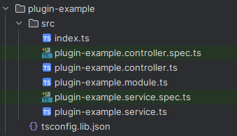
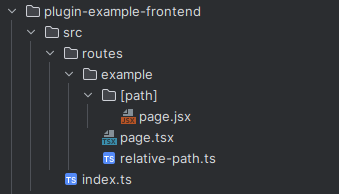
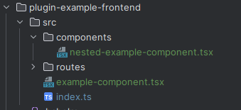
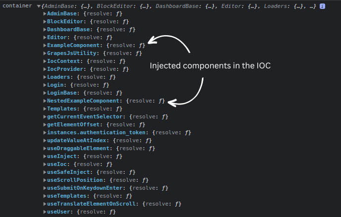
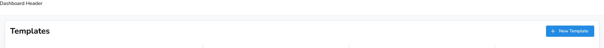

import Tabs from '@theme/Tabs';
import TabItem from '@theme/TabItem';

# Extending Functionality

## Introduction to Aetheria's plugin system

Aetheria's plugin system differs from in its approach to extension depending on the type of plugin.
There are two types of plugins:

- **Backend plugins**: are plugins that may be shipped with Aetheria and are specific to the backend.
  These plugins are loaded by the backend at runtime and they are not exposed to the frontend. <br />
  The simplest backend plugin is a [NestJS module](https://docs.nestjs.com/modules) that is dynamically registered but
  plugins may become more complex and provide almost unlimited functionalities.
- **Frontend plugins**: Frontend plugins are plugins that are loaded by the frontend at runtime and are exposed to the
  user in the UI or using other methodologies. <br />
  The simplest frontend plugins is a Next.js library exporting React components that are registered in the IOC container
  and already used or setup in the base installation. <br />
  Plugins may become far more complex and also register new routes and pages in the admin panel or other locations.

## Installing and activating plugins

Whatever the type of plugin, they are all installed and activated in the same way.
Plugins are installed via the cli shipped in both the backend and frontend packages.

<Tabs defaultValue="backend" groupId="system" queryString="system">
<TabItem value="backend" label="Backend">

```bash
# local installation
nest start cli plugin:install -n <plugin-name> -r <plugin-resolution-path>

# npm installation
nest start cli plugin:install -n <plugin-name> -N

# tarball installation
nest start cli plugin:install -n <plugin-name> -r <tarball-plugin-path> -t
```

</TabItem>
<TabItem value="frontend" label="Frontend">

```bash
# local installation
./apps/frontend-cli/bin/run plugin install -n <plugin-name> -r <plugin-resolution-path>

# npm installation
./apps/frontend-cli/bin/run plugin install -n <plugin-name> -N

# tarball installation
./apps/frontend-cli/bin/run plugin install -n <plugin-name> -r <tarball-plugin-path> -t
```

</TabItem>
</Tabs>

<details>
<summary>FAQ</summary>

#### Is there a way to install plugins without using the cli?

Yes, there is.

The cli is just a wrapper around a series of configuration tweaks that are required to install a plugin.
Even though you can manually install plugins it is strongly discouraged to do so as the cli will take care of all the
required steps for you without the risk of forgetting something.

#### Which is the difference between `local`, `npm` and `tarball` installations?

As you may have noticed, there are three different ways to install a plugin.
The difference between them is the way the plugin is resolved and installed.

As of v1.0.x ships with tree resolution strategies:

- **local**: the plugin is resolved from the local filesystem. This is the default strategy.
- **npm**: the plugin is resolved from the npm registry.
- **tarball**: the plugin is resolved from a tarball file.

:::caution
Do not rely on the `tarball` nor on the `npm` strategy until the publishing of the official APM as they are not yet
supported because of security concerns.
:::

#### How do I know which strategy to use?

As of v1.0.x the only supported strategy is the `local` one.
The `npm` and `tarball` strategies are not yet supported because of security concerns.

As of the release of the official APM, the shipped plugin manager will choose the correct strategy for you
based on the plugin and data available.

</details>

### Activating plugins

As of v1.0.x installed plugins are always activated.
In order to disable a plugin you have to uninstall it.

:::caution
As of v1.1.x this behaviour will change and plugins will be installed and activated by default but they can be disabled
without the need to uninstall them.
:::

*[APM]: Aetheria Plugins Marketplace

## Creating a plugin

Plugins differs in their structure depending on the type of plugin, but they all share the same basic requirements.

Each plugin must have a `package.json` file with the following minimal structure:

```json title="package.json"
{
	"name": "plugin-name",
	"version": "1.0.0",
	// optional fields
	"description": "A short description of the plugin",
	"authors": [
		{
			"name": "John Doe",
			"email": "john.doe@example.com"
		}
	]
}
```

Other fields such as `description` and `authors` may be present but they are not required.

<Tabs defaultValue="backend" groupId="system" queryString="system">
<TabItem value="backend" label="Backend">

Backend plugins are NestJS modules that are dynamically registered at runtime.
Anyway, the standard NestJS module structure is not enough for a plugin to be loaded by the backend.

:::note Plugin types
All plugins in order to be loaded by the backend must be CommonJS plugins as Nest does not support yet ESM modules.
Ensure you're using the correct plugin type by setting `"type": "commonjs"` inside your `package.json`.
:::

A standard NestJS library module looks like this:



If generated via the nest CLI usually the `index.ts` inside the `src` folder is not created.
This structure is anyway not enough, even if the `index.ts` file inside the `src` folder is created.

This is because in order to be automatically loaded at startup the plugin must export a default entrypoint from the root
of the library module.
This means that an additional `index.ts` file must be created in the root of the library module, aside the `src` folder.

A sample root `index.ts` file may look like this:

```typescript title="Root index.ts"
// Import the module from the src folder and export it as default entrypoint
import { PluginExampleModule } from "./src";

export default PluginExampleModule;

// Optionally (but suggested) also re-export all the modules and utilities from the src folder 
// in order to enhance the developer experience
export * from "./src";
```

:::info
In our example we've created and `index.ts` file inside the `src` folder that acts as an entrypoint for the whole
directory, this is not a requirement and you can easily import single files as you'd normally do.
:::

Depending on your setup your `tsconfig.json` file may need to be tweaked in order to allow the compiler to resolve the
`src` folder and the root `index.ts` as a whole. The simplest way to do so is to add the following lines aside the
`compilerOptions` object:

```json title="Partial of tsconfig.json"
{
	"include": [
		"**/*"
	]
}
```

If you've created your library module using the nest CLI you are already good to go, all its left to do is to build the
plugin and install it.

:::info
All plugins must be built before being installed as they are not automatically built by the plugin manager.
An un-built plugin will not be loaded by the backend.

An utility cli command is provided to build all plugins, inside the `libs` folder of the backend project you can run it
via `npm run build:plugins`.
:::

</TabItem>
<TabItem value="frontend" label="Frontend">

Frontend can be constituted by two different parts:

- **Next.js routes**: the next.js routes are exactly the same
  as [native routes](https://nextjs.org/docs/app/building-your-application/routing) for next.js and can be natively
  rendered as server components.
- **React components**: the react components are the same as the ones used in the frontend application but they are
  registered in the IOC container and can be injected as dependencies, this allows to replace the default components
  with custom ones without the need to modify the source code.

#### Next.js routes

Next.js routes are the same as the ones used in the frontend application, the only difference is that they are located
inside the `routes` folder of the plugin.



Inside the `routes` folder you can create the same folder structure as the one used in next.js standard application.
There is no need to use special references nor to import the routes anywhere, they will be automatically loaded by the
plugin manager.

:::info
The plugin manager will automatically load all the routes from all the plugins and merge them with the ones from the
frontend application.

Routes path collision will be resolved by the plugin manager by giving priority to the routes registered first, meaning
that if a route with the same path is registered by the frontend application and by a plugin, the frontend application
route will be used.

If you want to override a route from the frontend application you can do so using **React components**.
:::

#### React components

React components are simple react components that are registered in the IOC container and can be injected as dependencies
in other components or pages.



Registering components in the IOC container is done by simply exporting them from your library such as:

```typescript title="src/index.ts"
export * from "./example-component";
export * from "./components/nested-example-component"
```

That will make the components available to be injected in other components or pages and visible inside the container:



:::note
The components are registered in the IOC container using the same name as the one used in the library module.

```tsx title="src/example-component.tsx"
import { FC } from "react";

// exported as ExampleComponent in the IOC container
export const ExampleComponent: FC = () => {
	return <div>Example Component</div>;
}
```

```tsx title="src/components/nested-example-component.tsx"
import { FC } from "react";

// exported as NestedExampleComponent in the IOC container
export const NestedExampleComponent: FC = () => {
	return <div>Nested Example Component</div>;
}
```
:::

If you want to inject for example an header on the dashboard homepage you can do that by creating a component named 
`DashboardHeader`:

```tsx title="src/components/dashboard-header.tsx"
import { Header } from "@mantine/core";
import { FC } from "react";

export const DashboardHeader: FC = () => {
	return <Header height={50}>Dashboard Header</Header>;
};
```

and export it from the root `index.ts` file:

```typescript title="src/index.ts"
export * from "./components/dashboard-header";
```

Then as by default the component is already used if defined your brand new header will be automatically used in the
dashboard homepage:



</TabItem>
</Tabs>
